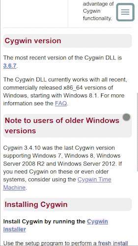
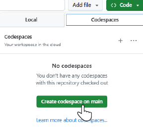

# cygwin-htdocs

Clone of [`cygwin-htdocs`](https://www.cygwin.com/cgit/cygwin-htdocs/), Cygwin's website files. This repo is to demonstrate proposed changes to [cygwin.com](https://www.cygwin.com/).

### Responsive Preview

<details>

<summary>Show Preview</summary>



</details>

## GitHub Pages

### `Ctrl + click` [HERE](https://jhauga.github.io/cygwin-htdocs/index.html) for Proposed Changes

> [!NOTE]
> The proposed changes can be toggled and compared by pressing `cc` quickly.

To view in GitHub Pages, and toggle changes:

- Press the `C` key twice, and within one second i.e. press `cc` quickly
  - This toggles back and forth from the proposed changes to the current `style.css`

## Codespace Local Server

To view proposed changes using a Codespace server; either follow the instructions step-by-step, or run:

```bash
bash ./.startSite.sh
```

after starting a new codespace.

### Instructions

#### 1. Open a new codespace



#### 2. Install Apache

```bash
sudo apt-get update
sudo apt-get install -y apache2
```

#### 3. Start the Server

```bash
/usr/sbin/apache2 -f /workspaces/cygwin-htdocs/httpd.conf.local -DFOREGROUND
```

Open `http://localhost:8000` in the Browser.

#### 4. Stop the Server

- Press `Ctrl+C` in the terminal running Apache, or:

## Patch Set Overview

<details>

<summary>May 8th, 2026</summary>

- [SUMMARY](outgoing-patches/05-08-2026/README.md)
- [access.patch](outgoing-patches/05-08-2026/access.patch)
- [add-pre-class.patch](outgoing-patches/05-08-2026/add-pre-class.patch)
- [cover-letter.patch.md](outgoing-patches/05-08-2026/cover-letter.patch.md)
- [css-variables.patch](outgoing-patches/05-08-2026/css-variables.patch)
- [font.patch](outgoing-patches/05-08-2026/font.patch)
- [gold-stars.patch](outgoing-patches/05-08-2026/gold-stars.patch)
- [responsive-styling.patch](outgoing-patches/05-08-2026/responsive-styling.patch)
- [top-logo.patch](outgoing-patches/05-08-2026/top-logo.patch)
</details>

<details>

<summary>April 17th, 2026</summary>

- [SUMMARY](outgoing-patches/04-17-2026/README.md)
- [add-html-star-entity-for-the-Gold-Stars-menu-item.patch](outgoing-patches/04-17-2026/add-html-star-entity-for-the-Gold-Stars-menu-item.patch)
- [add-logo-to-top.html.patch](outgoing-patches/04-17-2026/add-logo-to-top.html.patch)
- [clean-style.css.patch](outgoing-patches/04-17-2026/clean-style.css.patch)
- [css-variables-for-colors-to-keep-DRY.patch](outgoing-patches/04-17-2026/css-variables-for-colors-to-keep-DRY.patch)
- [fixed-menu-position.patch](outgoing-patches/04-17-2026/fixed-menu-position.patch)
- [font-weight-applied-hierarchically-per-menu-section.patch](outgoing-patches/04-17-2026/font-weight-applied-hierarchically-per-menu-section.patch)
- [h1-header-s-font-family-to-sans-serif.patch](outgoing-patches/04-17-2026/h1-header-s-font-family-to-sans-serif.patch)
- [link-hover-UX-effect.patch](outgoing-patches/04-17-2026/link-hover-UX-effect.patch)
- [responsive-styling.patch](outgoing-patches/04-17-2026/responsive-styling.patch)
- [style-code-HTML-elements.patch](outgoing-patches/04-17-2026/style-code-HTML-elements.patch)
- [style-pre-code-blocks.patch](outgoing-patches/04-17-2026/style-pre-code-blocks.patch)
</details>
